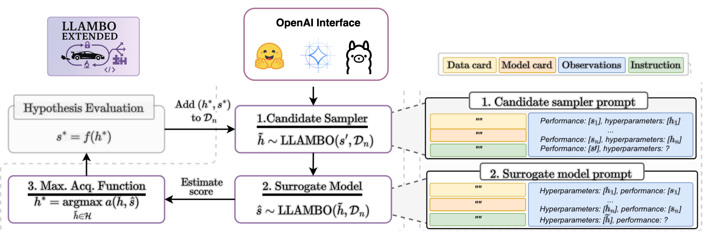
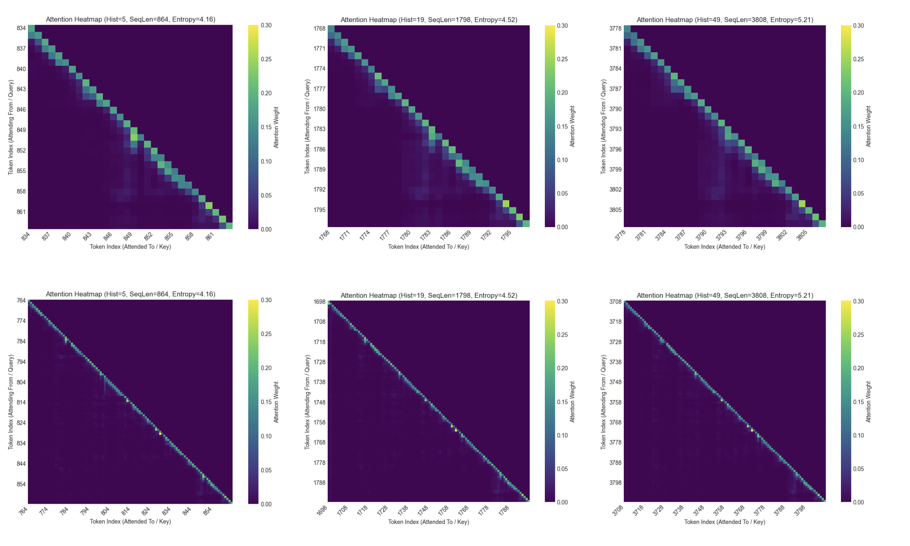

# LLAMBO EXTENDED


<p align="center">
    
</p>


Welcome to LLAMBO Extended! This project extends the original [LLAMBO](https://github.com/tennisonliu/LLAMBO) framework by Tennison Liu from the [van der Schaar Lab](https://www.vanderschaar-lab.com/).
LLAMBO Extended enhances the original by integrating support for a wide range of HuggingFace models, providing an accessible and open-source method for analyzing the behavior of Large Language Models (LLMs) in Bayesian Optimization (BO) contexts.

## Key Features

*   **HuggingFace Integration**: Leverages the vast HuggingFace ecosystem, allowing the use of numerous pre-trained LLMs.
*   **Flexible Acquisition Strategies**: Supports switching between Expected Improvement (EI) and Upper Confidence Bound (UCB) acquisition functions.
*   **Experiment Resumption**: Allows interrupted HPO experiments to be seamlessly resumed, saving valuable time and computational resources.
*   **Extensible Adapter**: The "Gemma Adapter" is designed for broad compatibility with HuggingFace models and provides useful LLM introspection capabilities.


## Gemma Adapter 

The core of this extension is the **Gemma Adapter**. Despite its name, this component is designed to seamlessly integrate a wide variety of models from the HuggingFace Hub into the LLAMBO framework.

Key aspects of the adapter:
*   **Broad Model Compatibility**: While initially inspired by Google's Gemma family of models, it's engineered to work with virtually any autoregressive model available on HuggingFace.
*   **Preserves Core Logic**: The adapter is built as a non-intrusive extension, maintaining the original LLAMBO's underlying Bayesian Optimization logic.
*   **Familiar API Design**: It aims to mirror common interaction patterns found in LLM APIs (such as the OpenAI API) for ease of use and integration.

The adapter also offers additional functionalities for deeper model analysis:

*   **`calculate_entropy`**: This method computes the entropy of the language model's predicted token distribution. Entropy can be a valuable metric for understanding model uncertainty or for guiding certain acquisition functions within the BO loop.
*   **`return_attention`**: This feature enables access to the attention weights from the transformer layers of the HuggingFace model. Inspecting attention weights allows for a deeper analysis of the model's internal decision-making process, revealing which parts of the input sequence the model focused on during text generation or processing.

Unfortunately, **`return_attention`** is currently hard-coded as `True`. A future iteration will offer the flexibility to toggle the logging of attention vectors.


## Analysing Attention 

Gaining insight into the internal workings of your LLM, specifically its attention mechanisms, can be invaluable for understanding its behavior within the Bayesian Optimization loop. This project draws inspiration from Neural Algorithmic Reasoning (NAR), where the goal is often to understand how models learn and execute step-by-step computational processes. By analyzing attention, we aim to shed light on what information the LLM prioritizes from the input prompts (e.g., past BO trial data, problem descriptions) when generating suggestions for the next hyperparameters to evaluate.

As the `return_attention` feature is enabled by default (currently hardcoded as `True`), attention data is readily available from your model runs. To help you make sense of this data, we provide a dedicated Jupyter Notebook:

*   **`demo_plots.ipynb`**: This notebook serves as a practical guide and toolkit for attention analysis. Inside, you will find:
    *   **Guidance on Accessing Attention Data**: How to retrieve the logged attention weights from your experiments.
    *   **Visualization Techniques**: Pre-built functions and examples for plotting attention maps, allowing you to visually inspect which input tokens the model focuses on.
    *   **Interpretative Examples**: Demonstrations of how these visualizations can be interpreted to understand the model's reasoning process during HPO tasks.

We encourage you to explore `demo_plots.ipynb` (located in the root directory or a relevant examples folder) to delve deeper into your model's decision-making process. This can help in debugging, building trust in the LLM's suggestions, and potentially uncovering novel strategies the model might be learning.


<p align="center">
    
</p>

## Environment Setup

Firstly, create a new Python environment (e.g., using `conda` or `venv`) and then install the required packages:

```
pip -r install requirements.txt
```

Afterwards, for reproducing the HPO results, run the following shell script to download the benchmark: 

```
./run_put_hpo_benchmark_in_place.sh
```

The script downloads the benchamrk, it unzips the folders and copies them in the \hpo_benchmarks forlder 


## Running the Experiments

For running the HPO benchmark use the following scrip: 

```
./run_hpo_bench.sh 
```

Unlike the original LLAMBO, we included two additional parameters in the script 

-- acq_strategy str: Allows the possibility to switch between an Expected Improvement or an Upper Confidence Bound strategy 

-- resume boolean: Assuming that you want to cotinue a run which you stopped, it reloads the logged information and resumes from the previous trial.  